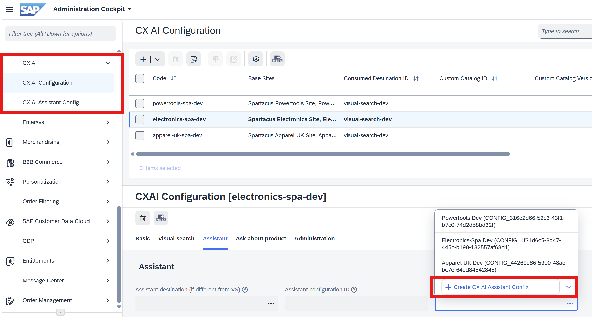
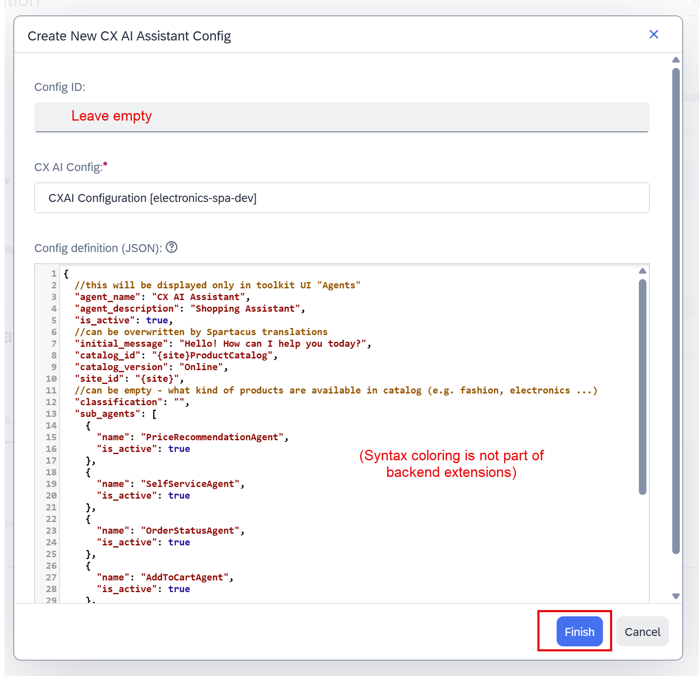
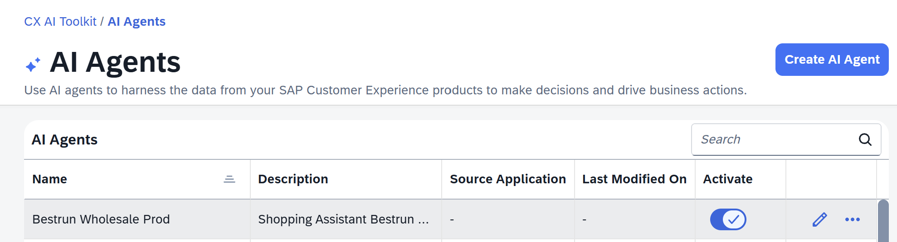
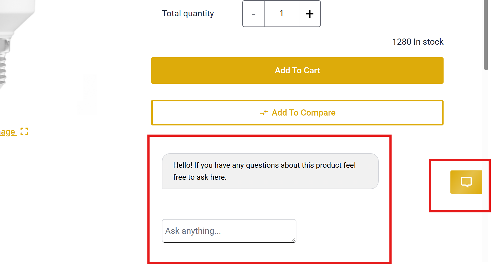

# SAP CX Assistant Chat and Ask Product UI Component
Spartacus library to use CXII Assistant and Ask Product API.
[](https://api.reuse.software/info/github.com/SAP-samples/cxii-shopping-assistant-ui-component)

## Description
- CXAI Assistant library for use with CXAI assistant API.
- CXAI Ask Product library for use with CXAI Ask Product API.

## Accelerator (JSP) version
This instruction is for Composable Storefront library. If you use Accelerator see [Accelerator Addon](cxaiaskproductaddon/README.md)

## JDK17
To use with JDK17 SAP Commerce Cloud, use [jdk17](https://github.com/SAP-samples/cxii-shopping-assistant-ui-component/tree/jdk17) branch.
**Note**: `jdk17` branch is no longer receiving updates, last version for it is `2211.47.1`

## Prerequisites
You need Commerce instance integrated with [CX AI Toolkit](README-toolkit.md)

## Quick Start Guide :rocket:
This guide allows you to quickly connect the component with your Spartacus application using default backend extensions.

### Add backend extensions
1. Add https://github.com/SAP-samples/cxii-commerce-extn as a git submodule to your codebase (jdk21 branch)

   `git submodule add -b jdk21 https://github.com/SAP-samples/cxii-commerce-extn` (usually inside `core-customize`)
2. Add https://github.com/SAP-samples/cxii-shopping-assistant-ui-component as a git submodule to your codebase (jdk21 branch)

   `git submodule add -b jdk21 https://github.com/SAP-samples/cxii-shopping-assistant-ui-component`
3. Add `cxaiocc`, `cxaibackoffice`, `cxaiaskproductocc` to `manifest.json` or `localextensions.xml`
4. Deploy with migrate data (update system)

### Add CX AI Toolkit Configuration
Run impex with toolkit configuration. **Enable code execution toggle in hac** to respect `if` directives. 
**Adjust values in `<braces>` to your local environment**.

```bash
# Site for which the configuration is applied
$siteUid = <site-uid>

# VS / assistant
$toolkitProdUrl = https://<usea-prod>.cxai.cloud.sap
$visualSearchProdUrl = $toolkitProdUrl/vision/api/v2
$assistantProdUrl = $toolkitProdUrl/shopping-assistant/api/v1

# Ask about product (you can leave it as-is if not used)
$askProductProdUrl = https://ai-assistant-<usea-prod>-api.cxai.cloud.sap

# Created by toolkit integration - <org-id> is your toolkit organisation id.
# You can also find this in Backoffice ConsumedOauthCredentials
$toolkitCredentialId = CXAICredentials_<org-id>
$askProductCredentialId = CXAIToolkitCredentials_<org-id>

# Assistant Config ID if already created by the API, otherwise ignore it for now
$assistantConfigIdProd = <CONFIG_67658b0c...>

INSERT_UPDATE ConsumedDestination; id[unique = true]  ; url                  ; destinationTarget(id); credential(id)          ; active[default = true]
                                 ; visual-search-prod ; $visualSearchProdUrl ; Default_Template     ; $toolkitCredentialId    ;
                                 ; ask-product-prod   ; $askProductProdUrl   ; Default_Template     ; $askProductCredentialId ;

# empty values are taken from spartacus provideConfig, concrete values overwrite spartacus config
INSERT_UPDATE CxaiConfig; code[unique = true]; baseSites(uid); consumedDestination(id); askProductDestination(id); active[default = false];
                        ; prod-$siteUid      ; $siteUid      ; visual-search-prod     ; ask-product-prod         ; 

#% if: "$assistantConfigIdProd".startsWith("CONFIG_")
INSERT_UPDATE CxaiAssistantConfig; cxaiConfig(code)   ; configId[unique = true];
                                 ; prod-$siteUid      ; $assistantConfigIdProd

UPDATE CxaiConfig; code[unique = true]; assistantConfig(configId)
                 ; prod-$siteUid      ; $assistantConfigIdProd
#% endif:

UPDATE CxaiConfig; code[unique = true]; active
                 ; prod-$siteUid      ; true
```

1. Open **Backoffice / CX AI Configuration** and select configuration that you've just created. 
    > If you can't see this section press F4 - reset everything - F4. If still can't see make sure `cxaibackoffice` extension is loaded in `hac`
2. Open **Assistant** tab. 
3. If there is no **Assistant configuration**, open the dropdown and select **Create CX AI Assistant Config**. 

4. Paste the following json into **Config definition (JSON)**, adjust `site_id` and `catalog_id` to your environment, and press **Save**.

```js
{
  //this will be displayed only in toolkit UI "Agents"
  "agent_name": "CX AI Assistant",
  "agent_description": "Shopping Assistant",
  "is_active": true,
  //can be overwritten by Spartacus translations
  "initial_message": "Hello! How can I help you today?",
  "catalog_id": "{site}ProductCatalog",
  "catalog_version": "Online",
  "site_id": "{site}",
  //can be empty - what kind of products are available in catalog (e.g. fashion, electronics ...)
  "classification": "",
  "sub_agents": [
    {
      "name": "PriceRecommendationAgent",
      "is_active": true
    },
    {
      "name": "SelfServiceAgent",
      "is_active": true
    },
    {
      "name": "OrderStatusAgent",
      "is_active": true
    },
    {
      "name": "AddToCartAgent",
      "is_active": true
    },
    {
      "name": "StockAgent",
      "is_active": true,
      "features": {
        "show_out_of_stock_recommendations": true,
        "allow_specific_quantity_stock_queries": false
      }
    }
  ],
  "global_settings": {
    "default_language": "en-us",
    // formal, casual ...
    "tone": "formal"
  }
}
```


> Save should be successful if CX AI credentials are correct. If there is an error, verify credentials and URL on **Basic** tab **Consumed Destination**.
6. Save CX AI Config with **Assistant configuration** filled in.

> **Hint:** You can also see your newly created Configuration in CX AI Toolkit **AI Agents** section 

### Add Components to Slots
Run the following impex to add components to CMS slots. You can adjust slot names (`ProductSummarySlot`, `FooterSlot`). If you use only one component then use only relevant half of this impex. Run the impex in `Online` `$version`, or synchronize components from Backoffice after they are created in `Staged`.

```bash
$contentCatalog = <site>ContentCatalog
$version = Staged
$contentCV = catalogVersion(CatalogVersion.catalog(Catalog.id[default=$contentCatalog]), CatalogVersion.version[default=$version])[default=$contentCatalog:$version]

##### Ask the Product ########

INSERT_UPDATE CMSFlexComponent; $contentCV[unique = true]; uid[unique = true]          ; name                        ; flexType
                              ;                          ; CxaiAskProductChatComponent ; CxaiAskProductChatComponent ; CxaiAskProductChatComponent

INSERT_UPDATE AskProductRestriction; $contentCV[unique = true]; uid[unique = true]    ; name                    ; components(uid, $contentCV)
                                   ;                          ; AskProductRestriction ; Ask Product Restriction ; CxaiAskProductChatComponent

# (+?) = append if not already appended
INSERT_UPDATE ContentSlot; $contentCV[unique = true]; uid[unique = true] ; cmsComponents(uid, $contentCV)
                         ;                          ; ProductSummarySlot ; (+?)CxaiAskProductChatComponent

##### Assistant ########
INSERT_UPDATE CMSFlexComponent; $contentCV[unique = true]; uid[unique = true]          ; name                        ; flexType
                              ;                          ; AssistantChatFloatComponent ; AssistantChatFloatComponent ; AssistantChatFloatComponent

INSERT_UPDATE AssistantRestriction; $contentCV[unique = true]; uid[unique = true]   ; name                  ; components(uid, $contentCV)
                                  ;                          ; AssistantRestriction ; Assistant Restriction ; AssistantChatFloatComponent

INSERT_UPDATE ContentSlot; $contentCV[unique = true]; uid[unique = true]; cmsComponents(uid, $contentCV)
                         ;                          ; FooterSlot        ; (+?)AssistantChatFloatComponent
```

### Configure Frontend
1. Open latest [release](https://github.com/SAP-samples/cxii-shopping-assistant-ui-component/releases) and add libraries to your `package.json`
2. `npm install`
3. Import `CxaiAskProductFeatureModule` and `CxaiAssistantFeatureModule` into your `app.module` imports[] array.
```ts
import { CxaiAskProductFeatureModule } from '@cx-spartacus/cxai-ask-product/feature';
import { CxaiAssistantFeatureModule } from '@cx-spartacus/cxai-assistant/feature';
//then add to imports[]
```
4. `ng serve`
5. By default you need to log in to use the components (OCC API is restricted)
    - If you want to allow anonymous user access set `cxai.anonymous.api.access.enabled=true` in hac / properties
    - If you don't want to allow anonymous access add `loggedInUser` restriction to `CMSFlexComponent`s
    ```bash
    UPDATE AbstractCMSComponent; uid[unique = true]          ; onlyOneRestrictionMustApply; restrictions(uid,$contentCV); $contentCV[unique = true];
                              ; AssistantChatFloatComponent ; false                      ; (-)loggedInUser,(+)loggedInUser
                              ; CxaiAskProductChatComponent ; false                      ; (-)loggedInUser,(+)loggedInUser
    ```
### Verify
If successful, you should be able to see chat component on every page (bottom right) and ask product component on product pages.


#### Common troubleshooting
1. If you can't see the components, try logging in or adjust `cxai.anonymous.api.access.enabled` property in hac
2. If you get `401` response from ask-product (despite correct credentials) make sure you [configured IAS client id](README-toolkit.md) in toolkit **Organization Management** - it should be the same as in `CXAIToolkitCredentials_<org-id>` `ConsumedOauthCredentials` created in Commerce after integrating with Toolkit.
3. Make sure you use proper URL formats in `ConsumedDestination`, exactly as specified in the sample impex
   * `https://{usea-prod}.cxai.cloud.sap/vision/api/v2` (in **Basic** tab)
     * Example of wrong URL: https://**api-**{usea-prod}.cxai.cloud.sap **/cxai/**...
   * https://**ai-assistant-**{usea-prod}.cxai.cloud.sap/ for ask product API (**Ask product** tab)
4. Make sure CX AI Config is `Active` in backoffice, and connected with a valid base site. `/occ/v2/{siteUid}/cxai/config` OCC endpoint should return an object including `assistantConfigId` (as assigned in **Assisant** tab)
5. Error `Content type 'application/json;charset=UTF-8' is not supported`:
    * `MappingJackson2HttpMessageConverter` and `StringHttpMessageConverter` must be registered in OCC converters chain
    * Default configuration registers them: `WebConfig.configureMessageConverters` → `super.addDefaultHttpMessageConverters(converters)` - if this was disabled you have to add above converters to the end of `messageConvertersV2` explicitly

## Next Steps
After finishing this quick start guide you can check detailed documentation:
- [Spartacus Workspace README](cxai-assistant-angular-lib/README.md) (how to customize, develop and debug the components)
- [Backend README](cxaiaskproductocc/README.md) Libraries require backend layer to communicate with toolkit API
- For production it is advised to fork / mirror original repositories (then add forks / mirrors as a submodules)

## How to Obtain Support
Create an issue in this repository if you find a bug or have questions about the content.

For additional support, ask a question in SAP Community.

## Contributing
If you wish to contribute code, offer fixes or improvements, please send a pull request. Due to legal reasons, contributors will be asked to accept a DCO when they create the first pull request to this project. This happens in an automated fashion during the submission process. SAP uses the standard DCO text of the Linux Foundation.

## License
Copyright (c) 2026 SAP SE or an SAP affiliate company. All rights reserved. This project is licensed under the Apache Software License, version 2.0 except as noted otherwise in the LICENSE file.